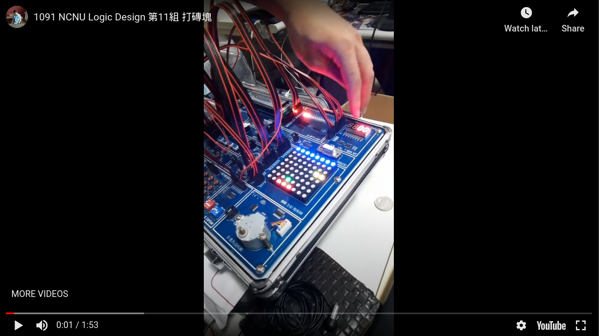

# FPGA-project

## Authors:108321019 108321032

Input/Output unit:

- 8x8 LED矩陣,顯示板子(紅色),磚塊(藍色),球(綠色),障礙物(黃色)

- 七段顯示器,顯示得分

- LED 陣列,顯示生命條(預設三條)


### 功能說明:
- 綠色球每次打到藍色磚塊,就會加一分
- 黃色障礙物會阻擋球的運行
- 粉色的球約經過四五秒就會出現,不受障礙物影響,可以直接打到磚塊
- 手動調整
    - 自由選擇球運行的速度
    - 在死亡後可以選擇要一排磚塊或兩排磚塊

### 程式模組說明:
```
module FPGA_FINAL(
    input CLK, reset, start,
    output reg [0:27] led,
    output reg [2:0] life,
    input left, right,
    input throw,
    input show_two_row,
    output testLED,
    output reg a,b,c,d,e,f,g,
    output reg [0:3] COM,
    input highSpeed
);
```
- input
    - CLK : 用來當作除頻器
    - reset : 當死掉時,可以重設球的位置到板子上
    - start : 用來啟動或暫停遊戲
    - left : 使板子向左移
    - right : 使板子向右移
    - throw : 當球在板子上,丟出球
    - show_two_row : 當死亡或勝利時,可以下次要一排或兩排磚塊(on 為兩排磚塊)
    - highSpeed : 選擇是否讓球快速地移動(on 為快速移動)
- output
    - led : 用來顯示8x8 LED
    - life : LED矩陣,顯示生命條
    - a,b,c,d,e,f,g : 操作七段顯示器
    - COM : 用來選擇要顯示哪個七段顯示器

### Demo video
[](https://www.youtube.com/watch?v=XruwCFJJvoA&feature=emb_title)
